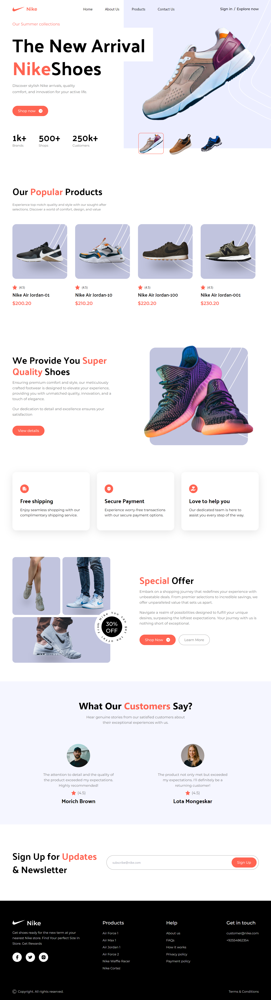

# Project Title

I have created a beautiful modern Nike website landing page using React and Tailwind.

## Demo



### Installation

_Below is an example of how you can instruct your audience on installing and setting up your app. This template doesn't rely on any external dependencies or services._

1. Clone the repo
   ```sh
   git clone https://github.com/alwazirf/nike-modern-app-react-tailwind.git
   ```
2. Install NPM packages
   ```sh
   npm install
   ```
3. Running this App
   ```sh
   npm run dev
   ```
